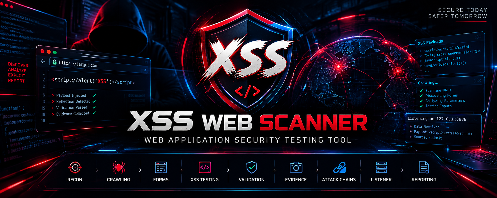

# 🛡️ XSS Web Scanner

<p align="center">
  
</p>

<p align="center">
  <strong>Web Application Security Testing Tool for Automated XSS Discovery, Validation, Evidence Collection & Reporting</strong>
</p>

<p align="center">
  <a href="https://www.python.org/"></a>
  <a href="https://www.selenium.dev/"></a>
  <a href="https://www.crummy.com/software/BeautifulSoup/"></a>
  <a href="https://owasp.org/www-community/attacks/xss/"></a>
  <a href="LICENSE"></a>
</p>

---

## 📌 Overview

**XSS Web Scanner** is a Python-based web application security testing tool designed to automate a multi-stage XSS assessment workflow.

The implementation combines:

- Target acquisition and validation
- Same-domain website crawling
- Dynamic page rendering with Selenium Firefox
- HTML parsing with BeautifulSoup
- Form discovery and input enumeration
- URL-parameter testing
- Form-input testing
- Multiple XSS payload categories
- Exploitation validation
- Evidence collection
- A local HTTP listener on `localhost:8888`
- Advanced attack-chain execution
- Markdown assessment report generation
- Impact classification
- Operational logging

> **Important:** This repository contains security-testing code intended only for systems you are explicitly authorized to assess. Do not use it against third-party systems without permission.

---

## 🧭 Table of Contents

- [Architecture](#-architecture)
- [Features](#-features)
- [End-to-End Workflow](#-end-to-end-workflow)
- [Phase 0 Target Acquisition](#1-phase-0--target-acquisition)
- [Phase 1 Reconnaissance](#2-phase-1--reconnaissance)
- [Phase 2 XSS Testing](#3-phase-2--xss-testing)
- [Validation & Evidence](#4-validation--evidence)
- [Advanced Attack Chains](#5-advanced-attack-chains)
- [Local Listener](#6-local-listener)
- [Reporting](#7-reporting)
- [Impact Analysis](#8-impact-analysis)
- [Function Reference](#-complete-function-reference)
- [Configuration](#-configuration)
- [Requirements](#-requirements)
- [Installation](#-installation)
- [Usage](#-usage)
- [Generated Files](#-generated-files)
- [Limitations & Implementation Notes](#-limitations--implementation-notes)
- [Legal & Security Notice](#-legal--security-notice)
- [License](#-license)

---

## 🧩 Architecture

```text
                    ┌──────────────────────────┐
                    │      Target URL          │
                    └────────────┬─────────────┘
                                 │
                                 ▼
                    ┌──────────────────────────┐
                    │ Target Acquisition &     │
                    │ Validation               │
                    └────────────┬─────────────┘
                                 │
                                 ▼
                    ┌──────────────────────────┐
                    │ Selenium / Firefox       │
                    │ Dynamic Page Rendering   │
                    └────────────┬─────────────┘
                                 │
                                 ▼
                    ┌──────────────────────────┐
                    │ Site Crawler             │
                    │ Same-Domain Discovery    │
                    └────────────┬─────────────┘
                                 │
                 ┌───────────────┴───────────────┐
                 ▼                               ▼
       ┌──────────────────┐             ┌──────────────────┐
       │ URL Parameters   │             │ HTML Forms       │
       │ Discovery        │             │ Discovery        │
       └────────┬─────────┘             └────────┬─────────┘
                │                                │
                └──────────────┬─────────────────┘
                               ▼
                    ┌──────────────────────────┐
                    │ XSS Payload Testing      │
                    └────────────┬─────────────┘
                                 │
                                 ▼
                    ┌──────────────────────────┐
                    │ Exploitation Validation  │
                    │ + Evidence Collection    │
                    └────────────┬─────────────┘
                                 │
                 ┌───────────────┴───────────────┐
                 ▼                               ▼
       ┌──────────────────┐             ┌──────────────────┐
       │ Advanced Attack  │             │ Local Listener   │
       │ Chains           │             │ localhost:8888   │
       └────────┬─────────┘             └────────┬─────────┘
                │                                │
                └──────────────┬─────────────────┘
                               ▼
                    ┌──────────────────────────┐
                    │ Markdown Assessment      │
                    │ Report + Logs            │
                    └──────────────────────────┘
```

---

## 🚀 Features

### 🎯 Target Acquisition
- Interactive target URL input.
- Explicit authorization confirmation before testing.
- HTTP/HTTPS validation.
- Basic domain-format validation.
- Initial accessibility check.

### 🕷️ Web Crawling
- Selenium-powered browser rendering.
- Same-domain URL discovery.
- Queue-based crawling.
- Configurable maximum depth.
- Dynamic JavaScript content loading.
- Form discovery during crawling.

### 🧪 XSS Testing
The scanner tests discovered attack surfaces through:
- URL query parameters.
- Form inputs.
- Multiple payload categories already defined in the source.
- Browser-based execution checks.
- Reflection checks.
- Local listener observations.

### 🔎 Validation
The implementation uses several indicators:
- Browser alert detection.
- Payload reflection in page source.
- Script-environment checks.
- Data received by the local listener.

### 📸 Evidence Collection
For confirmed results, the scanner records information including:
- Timestamp.
- Current URL.
- Page title.
- Deployed payload.
- Cookie accessibility result.
- A page-source snapshot.

### 📡 Local Listener
A local HTTP server listens on:

`http://localhost:8888`

The listener records GET and POST requests received during the assessment.

### 📝 Reporting
The tool generates a Markdown assessment containing:
- Target information.
- Assessment time.
- Scan duration.
- URLs mapped.
- Forms discovered.
- Successful exploitation count.
- Listener activity.
- Exploitation evidence.
- Impact descriptions.
- Remediation priorities.
- Scan metrics.

### 📋 Logging
Operational events are written to:
`libertas_operation.log`

The implementation uses Python's `logging` module with both file and console handlers.

---

## 🔄 End-to-End Workflow

The complete execution flow is:

```text
Start
  │
  ▼
Authorization Confirmation
  │
  ▼
Target URL Acquisition
  │
  ▼
Target Validation
  │
  ▼
Start Local Listener
  │
  ▼
Initialize Selenium Firefox
  │
  ▼
Phase 1: Crawl Target
  │
  ├── Discover URLs
  ├── Render JavaScript
  └── Extract Forms
  │
  ▼
Phase 2: XSS Testing
  │
  ├── Test URL Parameters
  ├── Test Form Inputs
  └── Validate Results
  │
  ▼
Successful Results
  │
  ▼
Advanced Attack Chains
  │
  ▼
Phase 3: Generate Report
  │
  ▼
Close Browser
  │
  ▼
Finish
```

---

## 1. 🎯 Phase 0 — Target Acquisition

### `acquire_target()`

This function is the entry point for the assessment.

It:

1. Displays an authorization warning.
2. Requests explicit confirmation.
3. Prompts for an HTTP/HTTPS target.
4. Calls `validate_target()`.
5. Returns the validated target URL.
6. Aborts if authorization or target validation fails.

### `validate_target(url)`

Performs the initial target checks:

- Parses the URL.
- Requires `http` or `https`.
- Requires a network location/domain.
- Performs an HTTP accessibility check.
- Validates the domain format.
- Returns `True` or `False`.

---

## 2. 🗺️ Phase 1 — Reconnaissance

### `init_driver()`

Creates the Selenium Firefox WebDriver and configures:

- Firefox options.
- Sandbox-related arguments.
- Web notification preferences.
- A 30-second page-load timeout.

The browser is used for dynamic page rendering and browser-based testing.

### `crawl_site(seed_url, max_depth)`

Builds a map of the target application.

For every discovered URL it:

1. Checks whether it was already visited.
2. Enforces the configured crawl depth.
3. Opens the URL in Selenium.
4. Waits for the page body.
5. Allows JavaScript execution time.
6. Parses the rendered page.
7. Extracts links.
8. Keeps URLs inside the target domain.
9. Adds discovered URLs to the queue.
10. Extracts forms from the current page.

The default maximum depth is **5**.

### `is_valid_url(url)`

Checks whether a discovered URL:

- Uses HTTP or HTTPS.
- Belongs to the same network location as `TARGET_URL`.

### `extract_forms(url, driver)`

Enumerates forms on a page and records:

- Form action.
- HTTP method.
- Source URL.
- Input names.
- Input types.
- Input element tags.

It searches for:

```text
<input>
<textarea>
<select>
```

---

## 3. 🧪 Phase 2 — XSS Testing

### `comprehensive_xss_testing()`

Coordinates the testing stage.

It performs:

1. URL-parameter testing across discovered URLs.
2. Form-input testing across discovered forms.
3. Advanced attack-chain execution for results marked as successful.

### `assault_url_parameters(url)`

Tests query-string parameters.

The function:

1. Parses the URL.
2. Extracts query parameters.
3. Replaces each parameter value with each payload.
4. Builds a test URL.
5. Opens the URL with Selenium.
6. Calls `validate_exploitation_success()`.
7. Captures evidence for successful results.
8. Records the vulnerability details.
9. Logs the result.

### `assault_form_inputs(form)`

Tests discovered form inputs.

The function:

1. Opens the form action.
2. Locates named input elements.
3. Places the payload into available fields.
4. Attempts normal form submission.
5. Falls back to JavaScript form submission when needed.
6. Waits for the resulting page.
7. Validates the result.
8. Captures evidence for successful results.

---

## 4. 🔬 Validation & Evidence

### `validate_exploitation_success(driver, payload)`

Uses several validation indicators.

#### Indicator 1 — Alert-Based Validation

The scanner waits for a browser alert and checks its text for expected XSS-related indicators.

#### Indicator 2 — Reflection Detection

The current page source is inspected for the tested payload.

#### Indicator 3 — Script Environment Check

The implementation executes a browser-side validation script to inspect the page environment.

#### Indicator 4 — Local Listener Data

The function also checks whether the local listener has received GET or POST data.

### `capture_exploitation_evidence(driver, payload)`

Creates an evidence dictionary containing:

- Timestamp.
- Current URL.
- Page title.
- Payload.
- Cookie-accessibility result.
- First 1,000 characters of the current page source.

---

## 5. ⚠️ Advanced Attack Chains

### `execute_advanced_attack_chains(vulnerable_url, successful_payload)`

When a result is marked as successfully exploitable, the implementation proceeds to additional browser-side attack-chain tests.

The source contains three categories of chains:

1. **Session/data collection chain**
   - Collects browser-side information.
   - Sends collected data to the local listener.

2. **Persistent page-manipulation chain**
   - Creates a visible security-test overlay.
   - Demonstrates page-content manipulation.

3. **Credential/form monitoring chain**
   - Monitors password fields.
   - Intercepts form submissions.
   - Sends captured test data to the local listener.

These chains are part of the uploaded source and are documented here without modifying or extending them.

---

## 6. 📡 Local Listener

### `ExploitationHandler`

A custom `BaseHTTPRequestHandler` implementation used by the local listener.

#### `do_GET(self)`

Records incoming GET requests, including:

- Timestamp.
- Request path.
- Client address.

#### `do_POST(self)`

Reads incoming POST data and records:

- Timestamp.
- Request path.
- POST body.
- Client address.

#### `log_message(self, format, *args)`

Redirects HTTP server logging into the Python logging system.

### `start_exploitation_listener()`

Starts an HTTP server on:

```text
localhost:8888
```

The server runs in a daemon thread and remains active during the assessment.

---

## 7. 📝 Reporting

### `generate_comprehensive_report()`

Creates a Markdown report containing:

- Target.
- Assessment date.
- Scan duration.
- Number of mapped URLs.
- Number of discovered forms.
- Successful exploitation count.
- Listener request statistics.
- Successful exploit details.
- Evidence information.
- Impact classification.
- Remediation priorities.
- Technical metrics.

The generated filename follows:

```text
libertas_assessment_<target>_<timestamp>.md
```

---

## 8. 💥 Impact Analysis

### `determine_exploitation_impact(exploit)`

Classifies the reported impact based on keywords found in the tested payload.

The implementation distinguishes categories such as:

- Session/cookie compromise.
- Keystroke logging.
- Content manipulation.
- Data exfiltration.
- Form interception.
- Client-side storage compromise.
- General client-side code execution.

This classification is generated by the implementation and should be treated as an automated assessment indicator rather than a substitute for manual security analysis.

---

## 📊 Complete Function Reference

| Function / Class | Purpose |
|---|---|
| `acquire_target()` | Interactive authorization and target acquisition |
| `validate_target(url)` | Validates target protocol, domain and accessibility |
| `ExploitationHandler` | Handles local listener requests |
| `ExploitationHandler.do_GET()` | Records incoming GET data |
| `ExploitationHandler.do_POST()` | Records incoming POST data |
| `ExploitationHandler.log_message()` | Integrates HTTP logs with Python logging |
| `start_exploitation_listener()` | Starts the localhost listener |
| `init_driver()` | Initializes Selenium Firefox |
| `close_driver()` | Closes the Selenium driver |
| `crawl_site(seed_url, max_depth)` | Crawls and maps the target |
| `is_valid_url(url)` | Enforces same-domain URL scope |
| `extract_forms(url, driver)` | Discovers and describes forms |
| `comprehensive_xss_testing()` | Coordinates XSS testing |
| `assault_url_parameters(url)` | Tests URL query parameters |
| `assault_form_inputs(form)` | Tests form inputs |
| `validate_exploitation_success(driver, payload)` | Validates test results |
| `capture_exploitation_evidence(driver, payload)` | Collects evidence |
| `execute_advanced_attack_chains()` | Runs the source's advanced test chains |
| `generate_comprehensive_report()` | Generates Markdown assessment |
| `determine_exploitation_impact(exploit)` | Classifies reported impact |
| `log_exploitation_success(vulnerability)` | Logs successful findings |
| `main()` | Controls the complete assessment lifecycle |

---

## ⚙️ Configuration

The source exposes several global configuration values:

| Setting | Default | Purpose |
|---|---:|---|
| `MAX_DEPTH` | `5` | Maximum crawler depth |
| `THREAD_COUNT` | `3` | Thread-count configuration value |
| `REQUEST_DELAY` | `0.5` | Request-delay configuration value |
| `EXPLOITATION_SERVER` | `http://localhost:8888` | Local listener address |
| `TARGET_URL` | Empty | Set dynamically during target acquisition |

The repository intentionally preserves these values exactly as implemented in the source.

---

## 📦 Requirements

The source imports these third-party Python packages:

- **Requests**
- **BeautifulSoup 4**
- **Selenium**

It also requires a working **Firefox browser** and a compatible Selenium WebDriver setup.

---

## 🛠️ Installation

### 1. Clone the repository

```bash
git clone https://github.com/eldqyqy2007/xss-web-scanner.git
cd xss-web-scanner
```

### 2. Create a virtual environment

```bash
python -m venv .venv
```

Activate it on Linux/macOS:

```bash
source .venv/bin/activate
```

On Windows:

```powershell
.venv\Scripts\activate
```

### 3. Install dependencies

```bash
pip install -r requirements.txt
```

### 4. Ensure Firefox is installed

The implementation initializes:

```text
Selenium + Firefox
```

A compatible WebDriver setup is required for execution.

---

## ▶️ Usage

Run the scanner with:

```bash
python xss_web_scanner.py
```

The program will:

1. Display the authorization notice.
2. Ask you to confirm authorization.
3. Request the target URL.
4. Validate the target.
5. Start the local listener.
6. Initialize Firefox.
7. Crawl the target.
8. Discover forms and URLs.
9. Test discovered attack surfaces.
10. Validate results.
11. Run the source's advanced chains for successful results.
12. Generate the Markdown assessment.
13. Close the browser.

Use only against applications you own or are explicitly authorized to test.

---

## 📁 Generated Files

During execution, the source can generate files such as:

```text
libertas_operation.log
libertas_assessment_<target>_<timestamp>.md
```

These runtime artifacts are ignored by the repository's `.gitignore` where appropriate.

---

## ⚠️ Limitations & Implementation Notes

This documentation describes the uploaded implementation as it currently exists; the source has **not** been modified as part of the repository setup.

Important implementation details:

- The crawler is limited by `MAX_DEPTH`, which defaults to 5.
- URL validation restricts discovered URLs to the same network location as `TARGET_URL`.
- Selenium Firefox is required for the browser-driven workflow.
- The local listener is bound to `localhost:8888`.
- The source defines `SQLI_PAYLOADS`, but the active testing workflow documented here does not include a dedicated SQL injection testing function.
- `THREAD_COUNT` and `REQUEST_DELAY` exist as configuration values in the source but are not used to create a separate threaded request engine.
- Automated impact classification is keyword-based and should not be treated as a complete business-impact assessment.
- Results should be manually reviewed before being treated as confirmed security findings.

---

## 🧪 Testing Philosophy

The implementation follows a staged security-testing workflow:

```text
Scope
  ↓
Reconnaissance
  ↓
Attack-Surface Discovery
  ↓
Input Testing
  ↓
Validation
  ↓
Evidence
  ↓
Impact
  ↓
Reporting
```

The objective is to turn a target URL into a structured assessment containing discovered application surfaces, test results, evidence, and a final Markdown report.

---

## 🔐 Legal & Security Notice

**XSS Web Scanner is intended for authorized security testing, research, and educational use only.**

You are responsible for ensuring that you have explicit permission to test every target.

Do not use this software to:

- Access systems without authorization.
- Capture credentials or private information from third parties.
- Disrupt production services.
- Test systems outside an approved penetration-testing scope.

The repository author and contributors are not responsible for misuse of this software.

---

## 🤝 Contributing

Contributions are welcome for documentation, testing, bug reports, and safe improvements.

When submitting changes:

1. Keep changes focused.
2. Explain the purpose of the change.
3. Preserve the documented scope of the project.
4. Never include real credentials, tokens, cookies, or private target data.

---

## 📜 License

This project is released under the **MIT License**. See [LICENSE](LICENSE) for the complete license text.

---

<p align="center">
  <strong>🛡️ XSS Web Scanner</strong><br>
  Web Application Security Testing • XSS Assessment • Evidence • Reporting
</p>
